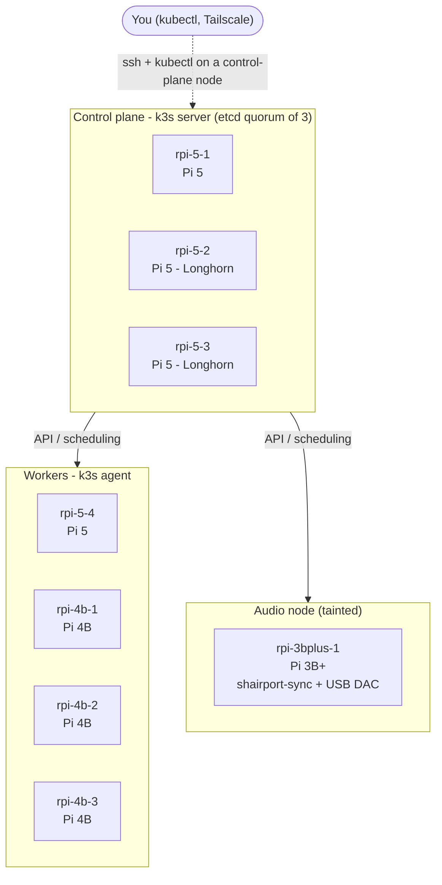
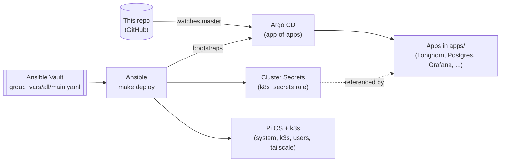

# Home Pi Infrastructure

A k3s Kubernetes cluster on a mix of Raspberry Pi 4s and 5s. Ansible handles the bare-metal and cluster
bootstrap; Argo CD handles everything that runs inside the cluster.

For the deeper "why" behind any of this — architecture notes, per-app config, troubleshooting — see
[docs/REFERENCE.md](docs/REFERENCE.md). This file is just the steps to get it running.

## Hardware

| Node | IP | Board | Role | Notes |
|---|---|---|---|---|
| `rpi-5-1` | 192.168.1.30 | Pi 5 | control plane (etcd + API) | `pi5=true` |
| `rpi-5-2` | 192.168.1.41 | Pi 5 | control plane | `pi5=true`, `storage=true` (Longhorn replicas) |
| `rpi-5-3` | 192.168.1.28 | Pi 5 | control plane | `pi5=true`, `storage=true` (Longhorn replicas) |
| `rpi-5-4` | 192.168.1.83 | Pi 5 | worker | `pi5=true` |
| `rpi-4b-1` | 192.168.1.13 | Pi 4B | worker | |
| `rpi-4b-2` | 192.168.1.14 | Pi 4B | worker | |
| `rpi-4b-3` | 192.168.1.18 | Pi 4B | worker | |
| `rpi-3bplus-1` | 192.168.1.15 | Pi 3B+ (1GB, SD card) | audio node | `audio_output=true`, tainted: runs only node-exporter, Vector and shairport-sync |

Pi 4B and 3B+ disks are too slow for etcd and heavy storage, so the control plane and the Longhorn replicas live on
Pi 5s. The IPs and groups are defined in `inventory.dist`.



How changes reach the cluster:



Ansible owns the machines and the secrets; Argo CD owns everything that runs in the cluster, straight from `apps/`.

## Setup (one time)

1. Clone and pull submodules:
   ```bash
   git clone https://github.com/joshdurbin/home-pi-infrastructure.git
   cd home-pi-infrastructure
   git submodule update --init --recursive
   ```

2. Edit `inventory.dist` with your node IPs.

3. Install Ansible collections:
   ```bash
   make install
   ```

4. Set up Tailscale (needed before deploying) — **two** separate OAuth clients, least-privilege (one lets
   nodes join the tailnet, the other lets the in-cluster operator expose UIs; a leaked credential for one
   shouldn't work for the other):
   - **Node-join client**: Tailscale admin console → Settings → OAuth clients → Generate. Scope: `write`
     for **Auth Keys** only. Tag: `tag:pi-node`.
   - **Operator client**: Generate another. Scope: `write` for Services, Devices Core, and Auth Keys. Tag:
     `tag:k8s-operator`.
   - Settings → Access Controls, merge into your policy:
     ```json
     "tagOwners": {
       "tag:pi-node": [],
       "tag:k8s-operator": [],
       "tag:k8s": ["tag:k8s-operator"]
     },
     "autoApprovers": { "services": { "tag:k8s": ["tag:k8s"] } }
     ```
   - Settings → enable "HTTPS Certificates".

5. Add secrets to Vault:
   ```bash
   ansible-vault edit group_vars/all/main.yaml
   ```
   ```yaml
   k3s_join_token: "<any random string>"
   tailscale_node_oauth_client_id: "<node-join client from step 4>"
   tailscale_node_oauth_client_secret: "<node-join client from step 4>"
   tailscale_oauth_client_id: "<operator client from step 4>"
   tailscale_oauth_client_secret: "<operator client from step 4>"
   searxng_secret_key: "<output of: openssl rand -hex 32>"
   searxng_metrics_password: "<output of: openssl rand -hex 32>"
   opensearch_admin_password: "<strong password - min 8 chars, upper, lower, digit, special char>"
   openwebui_secret_key: "<output of: openssl rand -hex 32>"
   openwebui_db_password: "<output of: openssl rand -hex 32>"
   grafana_db_password: "<output of: openssl rand -hex 32>"
   pgadmin_db_password: "<output of: openssl rand -hex 32>"   # the WhoDB Postgres login (name kept from an earlier tool)
   litellm_salt_key: "<output of: openssl rand -hex 24>"        # Bifrost's encryption key is derived from this; never change once set
   litellm_db_password: "<output of: openssl rand -hex 32>"     # Bifrost's DB password (name kept until renamed in the vault)
   goff_db_password: "<output of: openssl rand -hex 32>"
   goff_admin_api_key: "<output of: openssl rand -hex 32>"
   goff_evaluation_api_key: "<output of: openssl rand -hex 32>"
   # LLM provider keys are added in Bifrost's UI, not here (see docs/REFERENCE.md#bifrost)
   ```

6. Deploy everything:
   ```bash
   make deploy
   ```

7. Check it worked:
   ```bash
   make status
   ```
   All nodes should show `Ready`, all Argo CD Applications `Synced`/`Healthy`.

From there, Longhorn (storage), VictoriaMetrics/Grafana (metrics), OpenSearch/OpenSearch
Dashboards + VictoriaLogs (logs, dual-shipped to both), Blocky (DNS), SearXNG (search), the redis-operator
(Blocky's and SearXNG's own small caching clusters), WhoDB (a UI for browsing Postgres, OpenSearch and those caches),
CloudNativePG (a two-instance Postgres cluster on Longhorn volumes, free to schedule anywhere, behind PgBouncer poolers), Bifrost (an LLM gateway backed by Postgres and its own Redis cache), GO Feature Flag (a feature-flag service stored in that Postgres), Temporal (a
workflow orchestration platform, backed by that same Postgres cluster), shairport-sync on the dedicated audio node (AirPlay to a USB DAC), a Tor Snowflake proxy (committed, scaled to 0), Homepage (a dashboard linking out
to every other UI below), Open WebUI (a chat UI for LLMs, backed by Bifrost), the descheduler (periodically rebalances pods across nodes), Trivy Operator (continuous
vulnerability scanning), and the Tailscale Operator all come up on their own — Argo CD manages them from
this repo's `apps/` directory. See [docs/REFERENCE.md](docs/REFERENCE.md) for what each one does.

## Make targets

| Command | What it does |
|---|---|
| `make install` | Install required Ansible collections |
| `make deploy` | Run everything (`site.yml`) |
| `make deploy-system` | OS setup only (hardening, overclock, packages) |
| `make deploy-k3s` | k3s cluster install only |
| `make deploy-users` | User/SSH management only |
| `make deploy-secrets` | Seed cluster Secrets/ConfigMaps only |
| `make deploy-argocd` | Bootstrap Argo CD only |
| `make deploy-dashboards` | Import Grafana dashboards (needs a running Grafana; not part of `make deploy`) |
| `make destroy-cluster` | **Destructive.** Uninstall k3s on every node and remove `/var/lib/longhorn` (asks to confirm) |
| `make verify` | Node health + Argo CD Application status |
| `make status` | Node status + Argo CD Application status |
| `make logs` | Tail k3s logs from the first server |
| `make syntax-check` | Validate playbook syntax |
| `make lint` | Run `ansible-lint` |
| `make clean` | Remove local temp files |
| `make help` | Show this list |

## Common operations

### Take a node out for maintenance (drain, reboot, return)

Do **one node at a time**, from a **control-plane node** (`rpi-5-1`, `rpi-5-2` or `rpi-5-3`). Agent nodes have no
kubeconfig. If the target is itself a control-plane node, run these from a *different* one.

```bash
# 1. connect to a control-plane node (not the one you are about to drain)
ssh ansible@192.168.1.30            # rpi-5-1

# 2. make sure the cluster is healthy first
sudo kubectl get nodes
sudo kubectl -n longhorn get volumes.longhorn.io     # attached volumes: healthy
sudo kubectl -n postgres get cluster postgres        # healthy, 2 instances

# 3. cordon the target (no new pods land on it)
sudo kubectl cordon rpi-4b-2

# 4. drain it (evict its pods; DaemonSet pods and emptyDir data are expected)
sudo kubectl drain rpi-4b-2 --ignore-daemonsets --delete-emptydir-data

# 5. reboot the target
ssh ansible@192.168.1.14 sudo reboot

# 6. wait for it to come back Ready, then uncordon
sudo kubectl get node rpi-4b-2 -w
sudo kubectl uncordon rpi-4b-2

# 7. wait for Longhorn/Postgres to be healthy again before the next node
sudo kubectl -n longhorn get volumes.longhorn.io
sudo kubectl -n postgres get cluster postgres
```

(`kubectl drain` cordons the node itself, so step 3 is optional - it is listed so you can hold a node out of
rotation before draining.) Details, what to expect for each app, and what to do if a drain hangs are in
[Node Maintenance](docs/REFERENCE.md#node-maintenance).

### Get secrets out of the cluster

Secrets are created from the Ansible Vault by `make deploy-secrets`. To read one back, use `kubectl` from a
control-plane node (or your own machine with `KUBECONFIG` set) and decode it:

```bash
# one key of one secret
kubectl -n <namespace> get secret <name> -o jsonpath='{.data.<key>}' | base64 -d; echo

# every key of a secret, decoded
kubectl -n <namespace> get secret <name> -o json | jq -r '.data | map_values(@base64d)'

# list the secrets in a namespace / see a secret's key names without values
kubectl -n <namespace> get secrets
kubectl -n <namespace> get secret <name> -o json | jq -r '.data | keys[]'
```

Common ones:

| What | Namespace / secret | Key |
|---|---|---|
| Grafana admin | `monitoring` / `vmks-credentials` | `admin-user`, `admin-password` |
| OpenSearch admin | `opensearch` / `opensearch-admin-credentials` | `username`, `password` |
| Bifrost encryption key | `bifrost` / `bifrost-encryption` | `encryption-key` |
| Postgres app user (full connection info) | `postgres` / `postgres-app` | `password`, `uri`, `jdbc-uri`, `pgpass` ... |
| A database role's password (e.g. Grafana) | `postgres` / `<name>-db-credentials` (`grafana-`, `bifrost-`, `goff-`, `whodb-`, `temporal-`, `open-webui-`) | `username`, `password` |
| GO Feature Flag config (API keys, DB URI) | `go-feature-flag` / `goff-config` | `goff-proxy.yaml` |

The source of truth for the values *you* chose is the Vault, not the cluster:
```bash
ansible-vault view group_vars/all/main.yaml       # read
ansible-vault edit group_vars/all/main.yaml       # change, then: make deploy-secrets
```
Changing a secret in the Vault and running `make deploy-secrets` overwrites the in-cluster copy; editing the Secret
with `kubectl` directly gets overwritten the next time that runs.

## Accessing things

Once Tailscale is set up and synced:

| Service | URL |
|---|---|
| Homepage (links to everything below) | `https://home.<tailnet>.ts.net` |
| Argo CD | `https://argocd.<tailnet>.ts.net` |
| Grafana | `https://grafana.<tailnet>.ts.net` |
| Alertmanager | `https://alertmanager.<tailnet>.ts.net` |
| VictoriaMetrics | `https://victoriametrics.<tailnet>.ts.net/select/0/vmui/` |
| OpenSearch Dashboards | `https://opensearch.<tailnet>.ts.net` |
| Longhorn | `https://longhorn.<tailnet>.ts.net` |
| SearXNG | `https://search.<tailnet>.ts.net` |
| Blocky metrics | `https://blocky.<tailnet>.ts.net` |
| Temporal Web UI | `https://temporal.<tailnet>.ts.net` |
| Open WebUI | `https://chat.<tailnet>.ts.net` |
| WhoDB | `https://whodb.<tailnet>.ts.net` |
| Bifrost | `https://bifrost.<tailnet>.ts.net` |
| GO Feature Flag (Swagger) | `https://flags.<tailnet>.ts.net/swagger/index.html` |

(Replace `<tailnet>` with your tailnet's `.ts.net` domain — run `tailscale status` on any connected device
to find it.)

DNS (Blocky) itself is plain LAN access, not Tailscale — point clients at any node's IP on port 53.

**kubectl from your own machine:**
```bash
ssh jdurbin@<a-server-ip> sudo cat /etc/rancher/k3s/k3s.yaml > ~/.kube/config_rpi
sed -i '' 's/127.0.0.1/<that-same-ip>/' ~/.kube/config_rpi
export KUBECONFIG=~/.kube/config_rpi
kubectl get nodes
```

## More detail

[docs/REFERENCE.md](docs/REFERENCE.md) covers: project structure, the GitOps split between Ansible and
Argo CD, per-app configuration (Longhorn, VictoriaMetrics, VictoriaLogs, OpenSearch, Blocky, SearXNG,
redis-operator, WhoDB, Postgres/CloudNativePG, Temporal, Homepage, Open WebUI, descheduler, Trivy
Operator, Tailscale Operator), user management, node maintenance, and troubleshooting.
